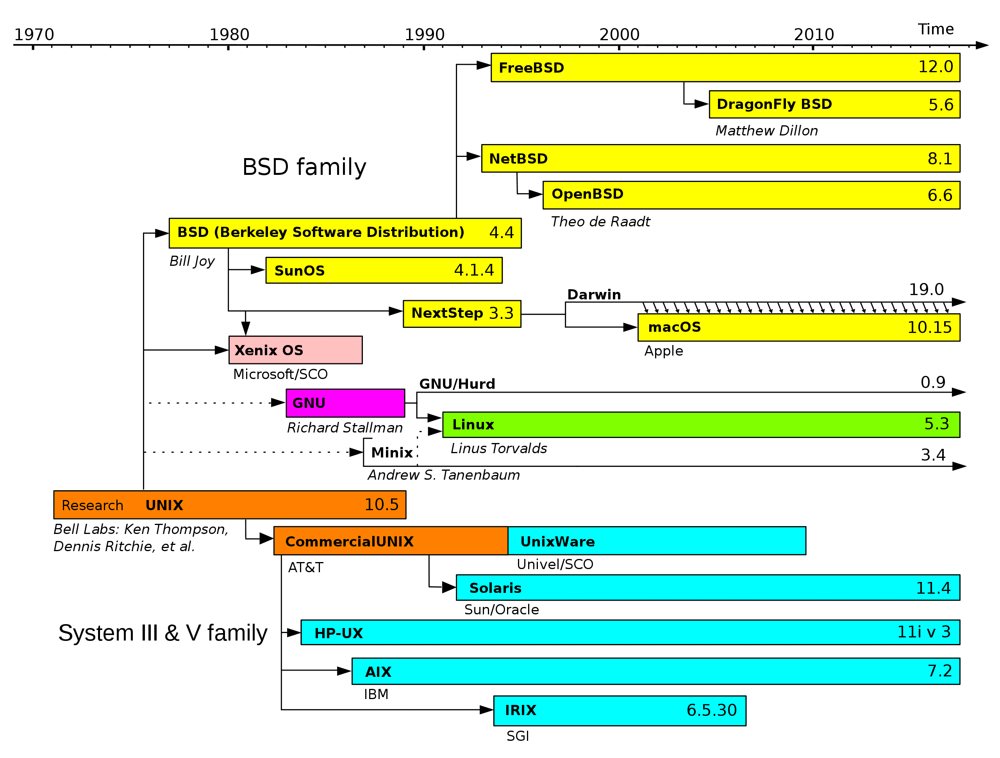

# Introducing LINUX

## Unix

is an OS developed by Bell Labs in 1960s through 1980s.

https://www.youtube.com/watch?v=tc4ROCJYbm0

### [UNIX Philosophy](https://en.wikipedia.org/wiki/Unix_philosophy)

-   Make each program do one thing well. To do a new job, build a fresh rather than complicate old programs by adding new "features".
-   Expect the output of every program to become the input to another, as yet unknown, program. Don't clutter output with extraneous information. Avoid stringently columnar or binary input formats. Don't insist on interactive input.
-   Design and build software, even operating systems, to be tried early, ideally within weeks. Don't hesitate to throw away the clumsy parts and rebuild them.
-   Use tools in preference to unskilled help to lighten a programming task, even if you have to detour to build the tools and expect to throw some of them out after you've finished using them.

### Organization
The Unix OS is collection of programs, each with a specific role:

-   kernel
-   shell
-   utilities

**Kernel**:

mediate access between user programs and system resources:
    -   CPU scheduling
    -   I/O to computer hardware
    -   memory
program request resources by making a syscall.

**Shell**

is a computer program that can execute other programs from a text-based interface.

In a text-based interface, you interact with a program completely from CLI with text commands and text outputs.

**Utilities**
Any distribution of UNIX will come with dozen of other programs that perform narrow single-purpose tasks.

The available utilities on a given system vary widely but some utilities are very common. E.g: command for make new directories, or move files

### Why UNIX still matters
-   portable to any kinds of hardware
-   consistent conventions
-   vast software eco
-   text!
-   various places using unix CLI: wifi routers, dsl and cable modems, raspberry pi, android phones, linux lap/ server, mac osx,...

GNU/ Linux, MacOS and Android are all based on ideas and specifications create by UNIX.

https://en.wikipedia.org/wiki/File:Unix_history-simple.svg

### LINUX

created by Linus Torvalds in 1991. He created Linux because at the time there was no single free, open-source reimplementation of the Unix operating system (the BSD kernel wasn't yet available yet) so he wrote his own kernel which became known as the Linux kernel.

(As of writting this) All top 500 super computers in the world run Linux.

### Why Linux?
-   Free
-   Well-maintained
-   Everywhere
-   Vast ecosystem/ users/ applications/ solutions,...

### What makes Linux Linux?

### Distros

So many distros: Ubuntu, Debian, Mint, Arch, Red Hat, Kali, CentOS,...

